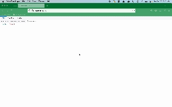

# Flask on Docker Project

I completed the tutorial [Dockerizing Flask with Postgres, Gunicorn, and Nginx](https://testdriven.io/blog/dockerizing-flask-with-postgres-gunicorn-and-nginx/) to deploy a Flask web application using Docker. It includes a Dockerfile to containerize the Flask app and two Docker Compose files to manage the application's services. The first file file, `docker-compose.yml`, is used for development, while `docker-compose.prod.yml` is for production. Both are configured to integrate a PostgreSQL database, but the latter also includes Gunicorn as the WSGI server and Nginx as a reverse proxy. I used Gunicorn instead of Flask's built-in development server because Gunicorn can handle multiple requests concurrenctly. Additionally, Nginx serves media files, improving performance and scalability. This setup ensures a secure and production-ready environment for Flask applications.



## Build Instructions

To build this project, first ensure that docker is installed on your computer. This program needs docker in order to run. If docker is not, you can follow the 'Without packages' option on this rootless mode [docker installation](https://docs.docker.com/engine/security/rootless/#install).

Once docker is installed, clone this repository and `cd` into it. Run
```
$ docker compose up -d --build
```
to build the containers. This command uses the default `docker-compose.yml` file to create the containers, which we want in the development stage when we are testing our application.

Check that the container is up and running by using the following command:
```
$ docker ps
```

Next, bring the service down to then build the production images and spin up the containers.
```
$ docker compose down -v

$ docker compose -f docker-compose.prod.yml up -d --build
$ docker compose -f docker-compose.prod.yml exec web python manage.py create_db
```
Since we are now in the production stage and want out application ready to interact with uses, we specificied an alternative compose file `docker-compose.prod.yml` from which to build the image. This file has a seperate `.env.dev` and is intergrated with Gunicorn and Nginx.

In your browser,
1. Connect to the port to upload your image at [http://localhost:5040/upload](http://localhost:5040/upload)
2. View the image at [http://localhost:5040/media/IMAGE_FILE_NAME](http://localhost:5040/media/IMAGE_FILE_NAME).

You can also use port forwarding to redirect 5040 to a different port and connect to that one in your browser.
